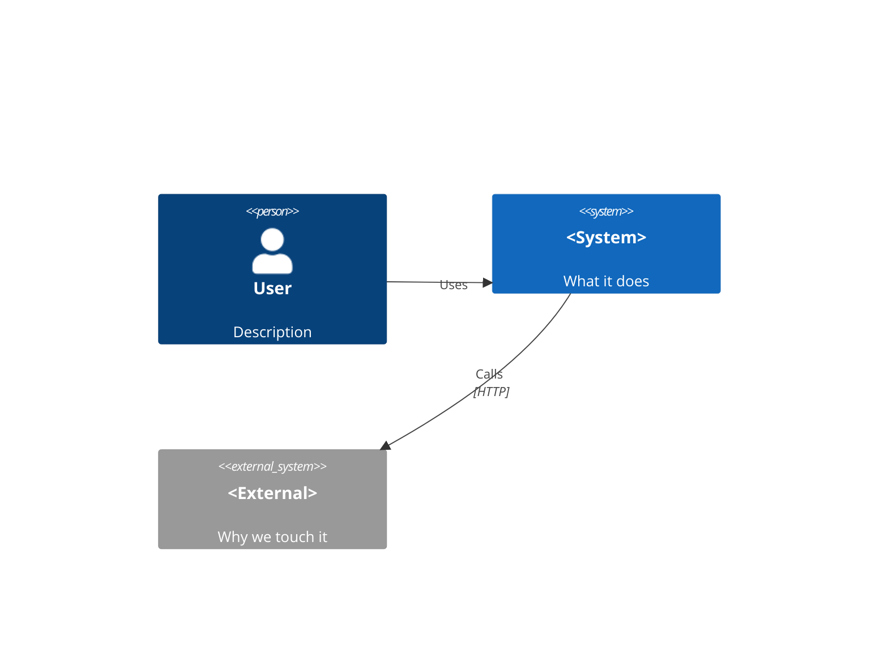
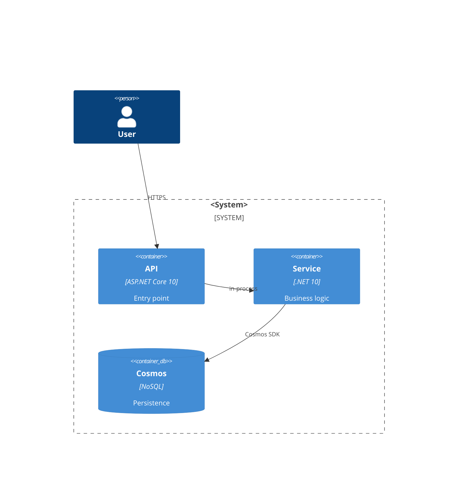
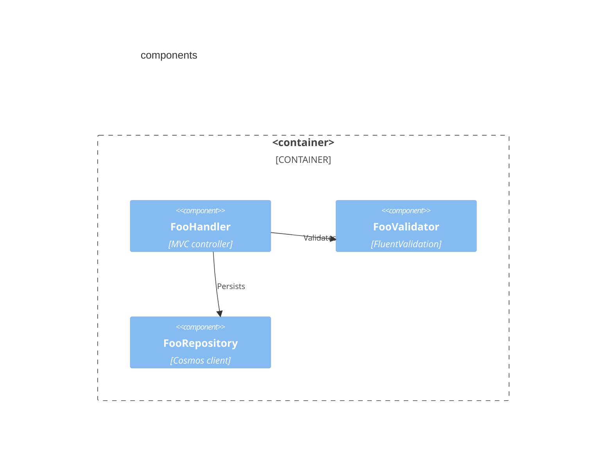

# Template — C4 diagrams output

Canonical shape for `/mad-c4` output. C1 (Context), C2 (Container), C3 (Component) Mermaid blocks.

> **EXAMPLE — replace this when authoring**

```markdown
# C4 Diagrams — <feature-name>

**Source spec**: specs/<N>-<slug>/spec.md
**Date**: <ISO date>

## C1 — Context



## C2 — Container



## C3 — Component (primary container)



## Anti-hallucination

- Containers/components named in diagrams must appear in spec or plan
- Mermaid syntax validated (closed blocks, valid C4 keywords)
```

## Reference

- `mad-spec/templates/spec.md` — input
- C4 model spec: https://c4model.com
